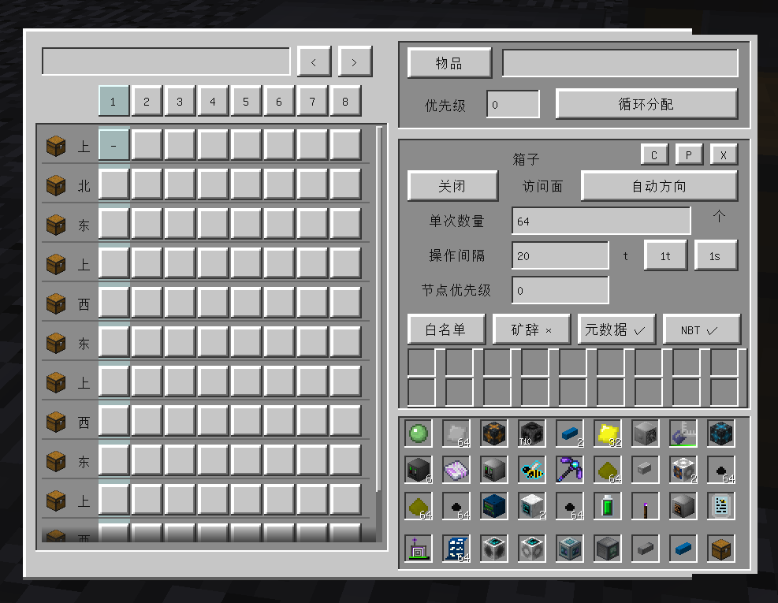
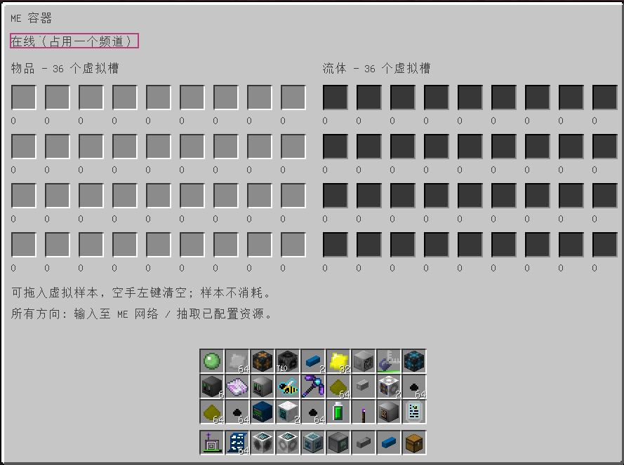
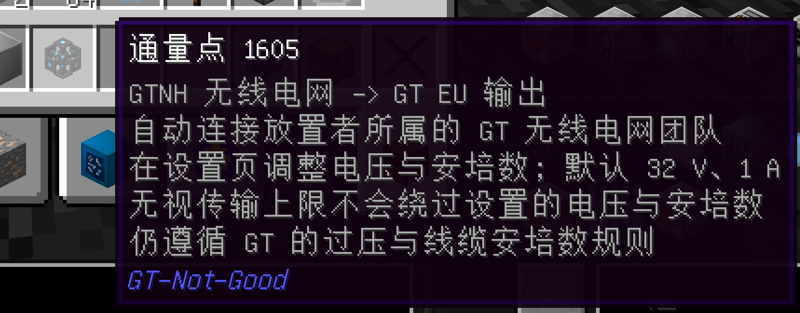
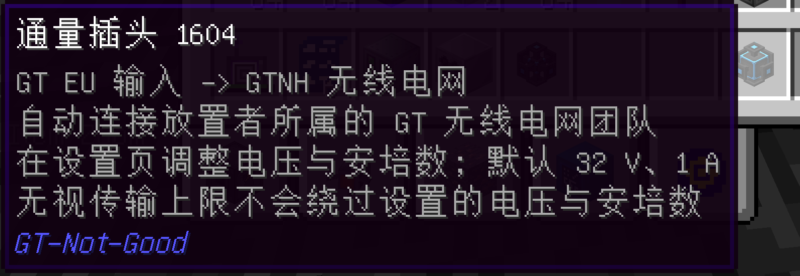
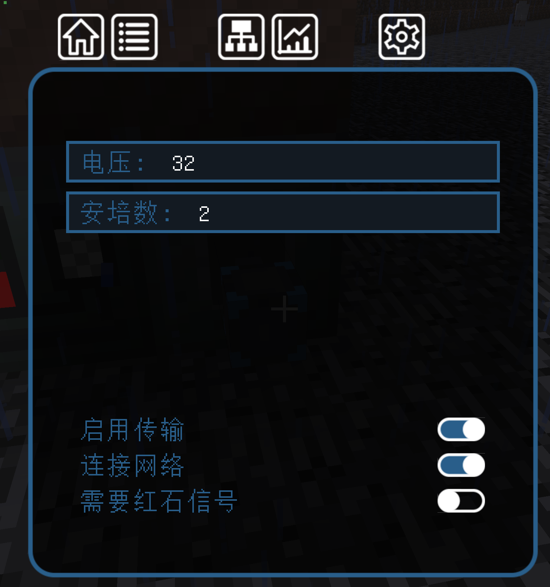

# GT-Not-Good
看名字你应该知道就是抄袭GTNL的模组

本模组大量引用了别人的代码甚至可以说抄袭 代码都是ai跑的

如有违反或让原作者不满 我会立即删除

本项目作自用 大量魔改修改难度

添加自定义任务线  介绍了本mod加了的一些物品方块和机器   加入BetterQuestingAPI这个mod可自动显现!!!
https://github.com/ABKQPO/BetterQuestingAPI

添加了个闪电科技封包功能
神秘时代注魔封包核心
装配线和进阶装配线封包核心
直接给神秘注魔自动化这坨大分杀了  直接给装配线杀了
 

本mod添加了个至尊功能 可以在配置文件关闭
只针对单方块
ae 两个接口对单方块机器下单 直接会在推料之前修改单方块机器里的虚拟编程电路
也就是说类似可编程电路mod  但是不需要额外写一个虚拟编程电路了 一个单方块机器 25种电路配方完全洒洒水啦
遇见bug 即时反馈 

本mod还对单方块机器添加了自己的虚拟模具槽 处于电路槽上方 可参与配方合成

mixin关闭了配方超净间需求

mixin开启了灵魂瓶能装所有 导致屠宰场所有生物可以有产物

### Current support version
| GTNH Version | Start Version | Newest Support Version |                                                            Download                                                            | Maintenance status |
|:------------:|:-------------:|:----------------------:|:------------------------------------------------------------------------------------------------------------------------------:|:------------------:|
| 2.9.0-beta2  |     1.0.0     |         1.0.1          |  | ❌ |
| 2.9.0-beta3  |     1.0.3     |         1.1.1          |  | ✔️ |

### 🔌 ME 网桥 / ME Bridge

    

<table align="center">
    <tr>
        <td align="center" width="50%"><strong>ME 网桥发起端</strong></td>
        <td align="center" width="50%"><strong>ME 网桥接收端</strong></td>
    </tr>
</table>

ME 网桥由发起端和接收端组成。
- **发起端**：连接 ME 网络，并可在 GUI 中配置频率(可设置中文)。
- **接收端**：通过GUI相同频率与发起端建立连接。
- 支持跨维度连接。
- 不占用 AE2 Channel。

    

ME 无线收发器
可直接右键空气打开频率选择界面，然后直接 shift + 右键，相关 AE2 节点即可直接连接。实在是太超模啦

### 🔌 ME无线二合一接口终端/ ME Wireless Dual Interface Terminal

    

    

如图所示 是一个集成编码 库存 接口终端为一体的无线二合一接口终端
自动填充nei配方时可直接在接口搜索栏里自动填入配方名称 
优化过不会出现 搜索栏里是组装机 4  结果组装机 24排在比组装机 4更上面的情况
可自动填充nei配方后 如果有和搜索栏相同的接口 直接会放入样板在里面

### 🔌 Xnet

    

完全抄袭Xnet

### 🔌 ME容器/ ME Container

    

添加me容器 可以配置物品或流体 然后从连接的ae网络里抽取 同步显示数量  然后可以被外部访问抽取

### 🔌 通量网络 / Flux Network

    

    

    

x

如图所示 抄袭

通量网络由发起端和接收端组成。
- **发起端**：连接通量网络，并可在 GUI 中配置频率(可设置中文)。
- **接收端**：通过GUI相同频率与发起端建立连接。
- 支持跨维度连接。

先写到这

