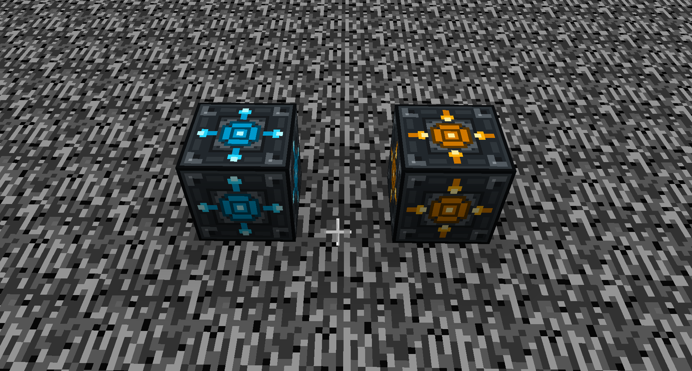
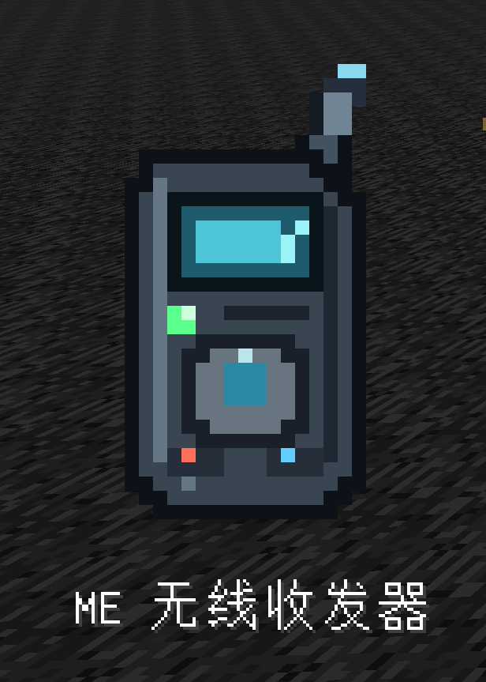
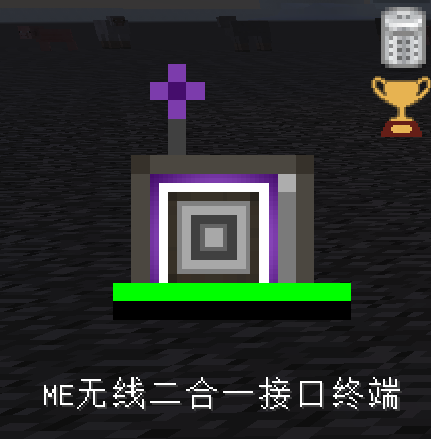
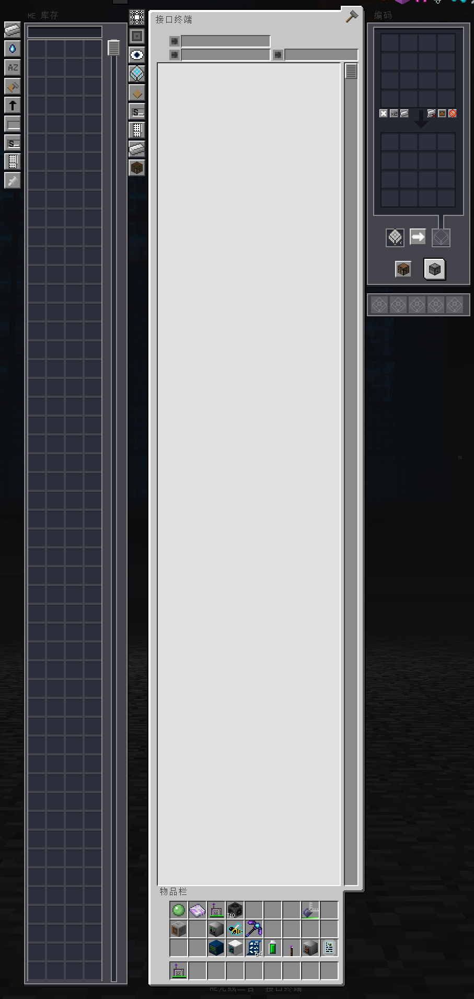

# GT-Not-Good
看名字你应该知道就是抄袭GTNL的模组

本模组大量引用了别人的代码甚至可以说抄袭 代码都是ai跑的

如有违反或让原作者不满 我会立即删除

本项目作自用 大量魔改修改难度

### Current support version
| GTNH Version | Start Version | Newest Support Version | Download | Maintenance status |
|:------------:|:-------------:|:----------------------:|:--------:|:------------------:|
| 2.9.0-beta2  | 1.0.0         | 1.0.1                  |  | ✔️ |
| 2.9.0-beta3  | 1.0.2         | 1.0.2                  |  | ✔️ |

### 🔌 ME 网桥 / ME Bridge

    

<table align="center">
    <tr>
        <td align="center" width="50%"><strong>ME 网桥发起端</strong></td>
        <td align="center" width="50%"><strong>ME 网桥接收端</strong></td>
    </tr>
</table>

ME 网桥由发起端和接收端组成。
- **发起端**：连接 ME 网络，并可在 GUI 中配置频率(可设置中文)。
- **接收端**：通过GUI相同频率与发起端建立连接。
- 支持跨维度连接。
- 不占用 AE2 Channel。

    

ME 无线收发器
可直接右键空气打开频率选择界面，然后直接 shift + 右键，相关 AE2 节点即可直接连接。实在是太超模啦

### 🔌 ME无线二合一接口终端/ ME Wireless Dual Interface Terminal

    

    

如图所示 是一个集成编码 库存 接口终端为一体的无线二合一接口终端
自动填充nei配方时可直接在接口搜索栏里自动填入配方名称 
优化过不会出现 搜索栏里是组装机 4  结果组装机 24排在比组装机 4更上面的情况
可自动填充nei配方后 如果有和搜索栏相同的接口 直接会放入样板在里面

先写到这

