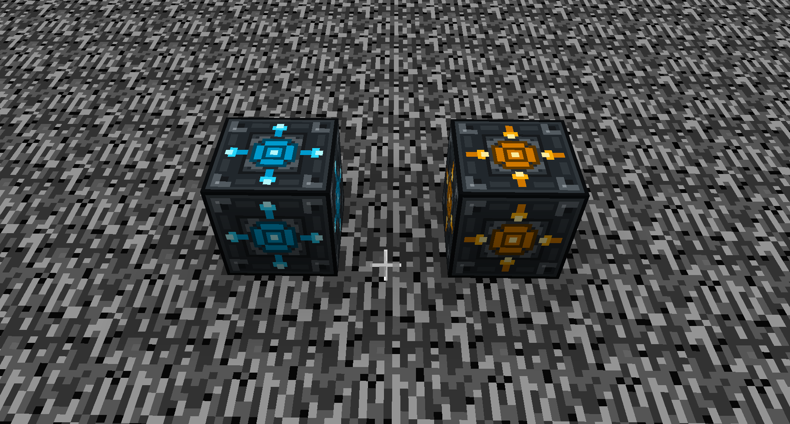
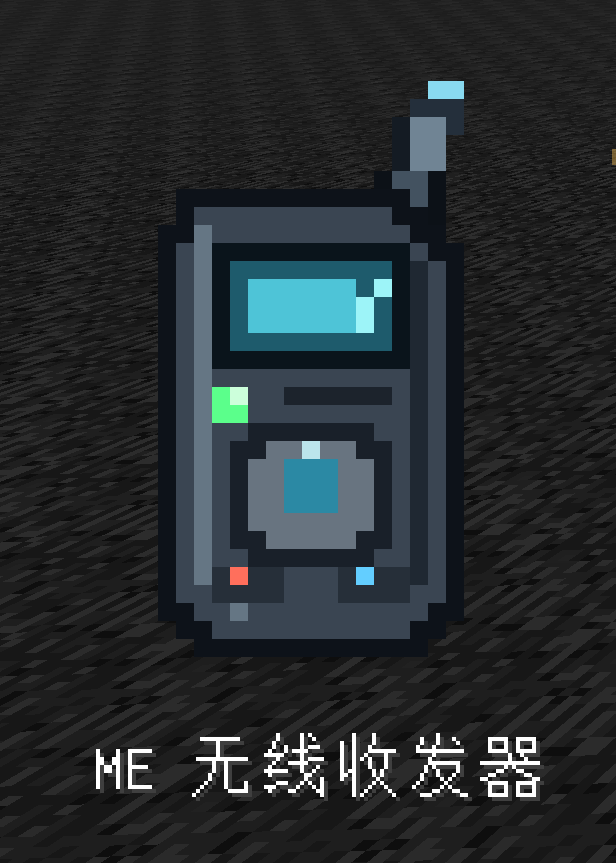
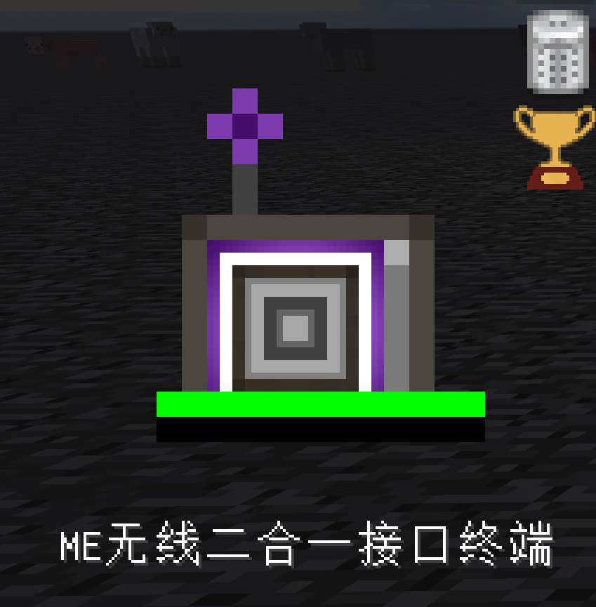
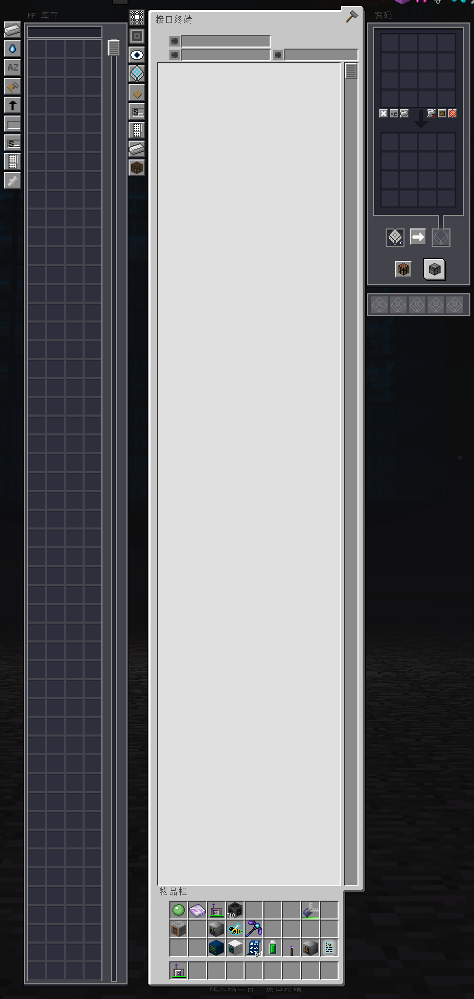
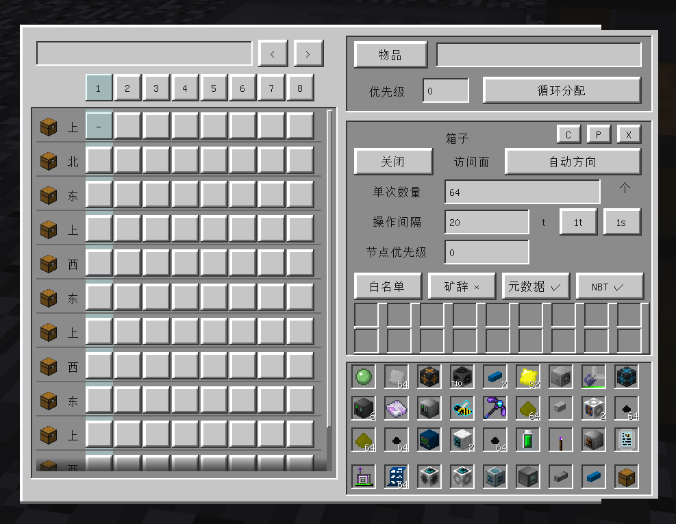
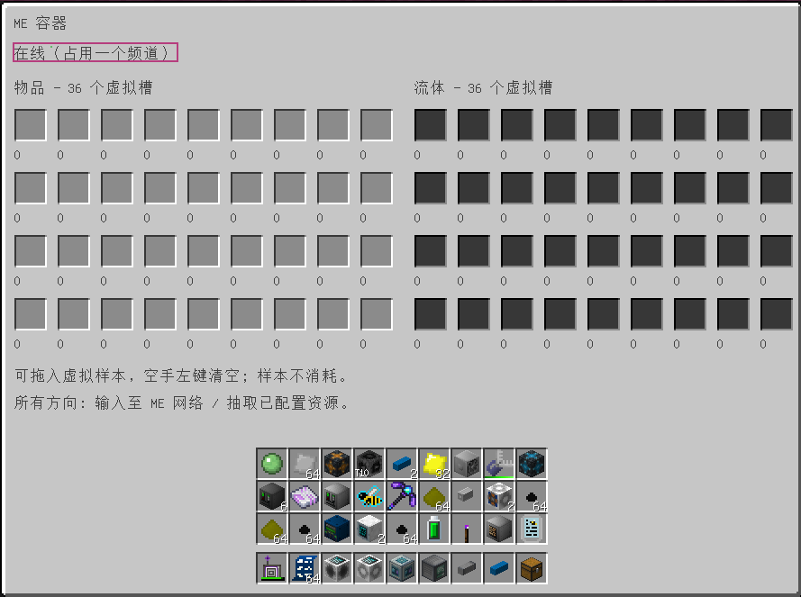
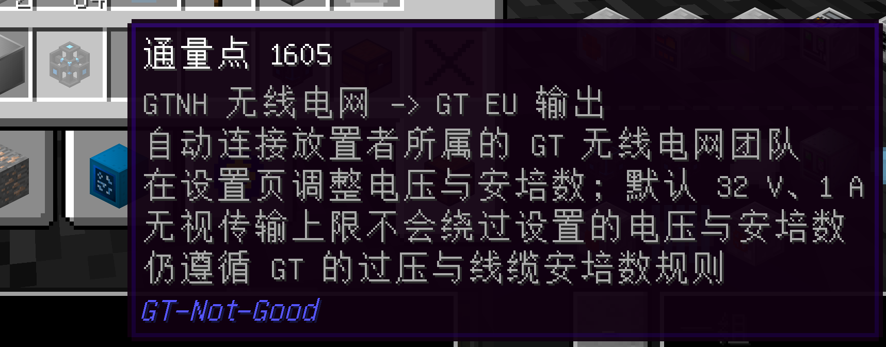
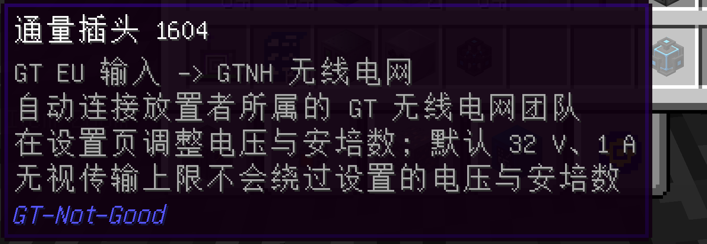
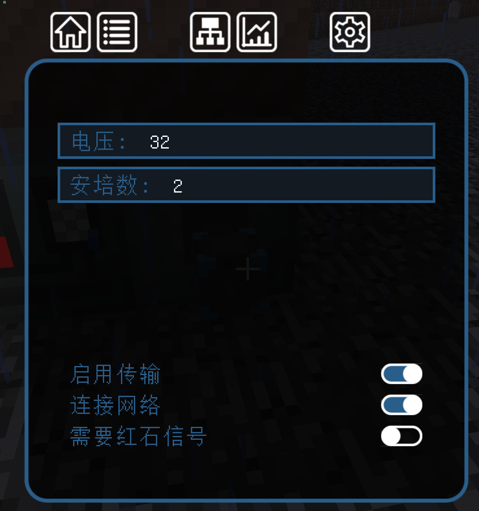

# GT-Not-Good
看名字你应该知道就是抄袭GTNL的模组

本模组大量引用了别人的代码甚至可以说抄袭 代码都是ai跑的

如有违反或让原作者不满 我会立即删除

本项目作自用 大量魔改修改难度

添加自定义任务线  介绍了本mod加了的一些物品方块和机器   加入BetterQuestingAPI这个mod可自动显现!!!
https://github.com/ABKQPO/BetterQuestingAPI

添加了个闪电科技封包功能
神秘时代注魔封包核心
装配线和进阶装配线封包核心
直接给神秘注魔自动化这坨大分杀了  直接给装配线杀了
 

本mod添加了个至尊功能 可以在配置文件关闭
只针对单方块
ae 两个接口对单方块机器下单 直接会在推料之前修改单方块机器里的虚拟编程电路
也就是说类似可编程电路mod  但是不需要额外写一个虚拟编程电路了 一个单方块机器 25种电路配方完全洒洒水啦
遇见bug 即时反馈 

本mod还对单方块机器添加了自己的虚拟模具槽 处于电路槽上方 可参与配方合成

虚拟模具列表新增 GGFab 的八种一次性工具铸件：锉、扳手、撬棍、剪线钳、锻造锤、软锤、螺丝刀和锯子。
单方块机器和超级样板输入总成均可在虚拟模具选择器中使用。

mixin关闭了配方超净间需求

mixin开启了灵魂瓶能装所有 导致屠宰场所有生物可以有产物

### Current support version
| GTNH Version | Start Version | Newest Support Version |                                                            Download                                                            | Maintenance status |
|:------------:|:-------------:|:----------------------:|:------------------------------------------------------------------------------------------------------------------------------:|:------------------:|
| 2.9.0-beta2  |     1.0.0     |         1.0.1          |  |         ❌          |
| 2.9.0-beta3  |     1.0.3     |         1.1.5          |  |         ✔️         |
|  2.9.0-RC-1  |     1.1.6     |         1.3.10         |  |         ✔️         |

最新版本：[1.3.10 发布说明](https://github.com/ikkkkkkkuuu/GT-Not-Good/releases/tag/1.3.10)。
下载：[游戏用 JAR](https://github.com/ikkkkkkkuuu/GT-Not-Good/releases/download/1.3.10/gtnotgood-1.3.10.jar) · [源码 JAR](https://github.com/ikkkkkkkuuu/GT-Not-Good/releases/download/1.3.10/gtnotgood-1.3.10-sources.jar)。

1.3.4 因启动错误已撤回，请更新到 1.3.10。

### 大型矿石处理机

保留原有粉末和宝石产量，按原生筛选、粉碎、热离心和离心配方补齐缺失副产物，覆盖原矿、粗磨矿、洗净矿和下界/末地富矿。
例如方钍石保留 8 个原粉，并追加独立的钍粉（6%、3%）和钍-232粉（1%）；富矿产量翻倍，概率不变。
按实际材料匹配配方，避免石墨等矿石通过矿辞分组继承其他材料的产物。
按输入的加工阶段导入，保留原生数量、概率与独立槽位；不同可选路线不重复叠加，不追加化学处理或需要额外物品、流体的配方。
已核对当前开发环境的 335 种材料、3722 条输入配方，原有 67 种材料、580 条筛选配方继续通过，详见 [矿石副产物与验证说明](docs/testing/ore-sifting.md)。

### 电路样板总成（ME）

支持 **900 个样板槽**，每个样板独立缓冲 **64 种物品和 64 种流体**，每种上限 **2⁶³−1**。
将不同编程电路的处理样板放进同一个总成，总成自动读取各自电路，AE 下单不需要提供实物编程电路。
每份样板也会独立识别模具目录中、对应 GT 配方不消耗的工具，AE 下单无需提供这些工具；实际消耗的模具仍需供料。
按配方输入、输出和数量共同核对；无法确认或存在消耗歧义时保留实体材料需求。
已注册到接口终端，名称随连接的多方块主机配方图更新，支持无线二合一接口终端上传与取回样板。
界面只保留手动物品槽，不提供虚拟模具槽、手动电路配置和批量写电路按钮。
总成合成配方的编程电路编号改为 **23**。
GT 每次读取的物品与流体数量仍受 `int` 限制，消耗后从 `long` 缓冲继续补充。
存档、拆除、放回和退料保留完整数量，ME 暂时拒收的材料会保留并重试退回。

无线二合一接口终端新增“保留电路与虚拟模具物品”开关，默认关闭。
开启后，NEI 导入处理配方时保留不消耗的编程电路，以及当前虚拟模具列表中允许的物品；其他不消耗物品仍跳过。
允许列表直接使用现有虚拟模具数据，后续更新自动生效；含流体配方仍使用 GTNH 原生至尊编码样板。

### 无线电网 HUD

每位玩家均可使用，默认按 **P** 开关，不需要物品或饰品；可在控制设置中改键。
默认按 **Home** 进入位置编辑，左键拖动整块 HUD；再次按 Home、Esc 或“保存并退出”保存位置。
编辑界面可恢复默认位置，关闭 HUD 时也能预览调整；编辑按键可在控制设置中修改。
显示所属 GT 无线电网的电量、实时净 EU/t、最近五分钟平均净 EU/t，以及安培数和电压等级。
每 100 tick 同步一次，首次开启先采样；关闭后停止请求。

使用 `/gtngtexteffects wireless` 打开滚动颜色预览，或绑定“配置无线 HUD 滚动颜色”按键。
配色、特效、粗体与斜体独立保存，不影响机器“添加者”署名。
`config/GTNOTGOOD/gtnotgood-wireless-monitor.cfg` 可配置 `Speed`、`Palette`、`CustomPalette`、
`AnimatedColors`、`AnimateValues`、`Scale`、`XOffset`、`YOffset` 和科学计数法；文件中的手动修改重启客户端生效。
默认整行动态颜色；设置 `AnimateValues=false` 后仅标题滚动，净功率保留绿增红减。
默认放在左下方，可与 GT-Simple-Wireless-Network 同时安装，各自的开关与配置独立。

### 🔌 ME 库存控制

1.2.8 新增阈值输出总线、双阈值发信器、ME 自动请求器与自动请求终端，支持物品和 GTNH 原生流体。
阈值总线按网络保留量输出，双阈值发信器在上下限之间保持状态，请求器通过 AE 合成 CPU 自动补齐目标库存。
四个界面使用上游原贴图、布局和交互；流体以 L 输入和显示，1000 就是 1000 L，不做桶单位换算。
大量放置时采用资源监听、休眠、通知合并和每网限额队列。详细用法与测试范围见 [ME 库存控制说明](docs/ME_STOCK_CONTROLS.md)。

### 🔌 ME 网桥 / ME Bridge

    

<table align="center">
    <tr>
        <td align="center" width="50%"><strong>ME 网桥发起端</strong></td>
        <td align="center" width="50%"><strong>ME 网桥接收端</strong></td>
    </tr>
</table>

ME 网桥由发起端和接收端组成。
- **发起端**：连接 ME 网络，并可在 GUI 中配置频率(可设置中文)。
- **接收端**：通过GUI相同频率与发起端建立连接。
- 支持跨维度连接。
- 不占用 AE2 Channel。

    

ME 无线收发器
可直接右键空气打开频率选择界面，然后直接 shift + 右键，相关 AE2 节点即可直接连接。实在是太超模啦

### 🔌 ME无线二合一接口终端/ ME Wireless Dual Interface Terminal

    

    

如图所示 是一个集成编码 库存 接口终端为一体的无线二合一接口终端4
自动填充nei配方时可直接在接口搜索栏里自动填入配方名称 
优化过不会出现 搜索栏里是组装机 4  结果组装机 24排在比组装机 4更上面的情况
可自动填充nei配方后 如果有和搜索栏相同的接口 直接会放入样板在里面

NEI → GTNotGood 新增“优先使用本模组接口自动命名”，默认“否”。
开启后，超级样板输入总成等使用自己的自动名称，忽略 GTNL 等模组追加的命名后缀，保留电路、手动槽和模头编号。
各玩家独立保存设置，切换后重新打开接口终端生效。
总成按已连接主机的当前配方池命名，名称与 NEI 配方类别一致；换池后名称跟随更新，保留编号和自定义名称。

### 🔌 Xnet

    

完全抄袭Xnet

### 🔌 ME 大容量二合一接口

金橙色外观，900 个样板槽，9 列滚动显示；MUI2 界面默认使用高版本 AE2 Dark Mode 的深色面板、槽位、侧栏按钮与优先级窗口材质。空槽保留空白样板底图，已放样板显示产物与数量。接口终端从 2 行按样板动态展开，沿用超级样板输入总成的行数规则。保留原版二合一接口的左侧设置、优先级与升级槽；不提供库存标记拉取，仍接收物品和流体产物回 AE。合成使用原版二合一接口与超级样板输入总成，方块和线缆部件可互转。详见 [大容量二合一接口说明](docs/large-me-interface.md)。

### 装配矩阵接口终端

默认显示 2 行，按最后一个非空样板槽自动展开，取走末尾样板后自动收缩，无需重开终端。沿用超级样板输入总成的整行末格扩展规则，最多 64 行，保留全部 576 个真实样板槽。

### 🔌 库存 IO 接口 (ME)

完整方块或线缆贴面紧贴 GT 单方块机器，加工配方或发电燃料直接使用 AE 网络里的物品与流体，只扣除实际消耗，不提前填入机器输入槽或燃料罐。
物品、流体各 900 个标记，合并分页 GUI，支持网络保留量、固定可用量、自动标记和产物回收。
回收遵守机器面与覆盖板权限，只取明确输出槽、输出罐；已标记产物也能回收，输入保持不动。
使用 ME 接口模型与高级 IO 总线的紫色配色，ME 接口与高级 IO 总线无序合成。
完整方块与线缆面板可 1:1 无序互转，完整保留配置与待退回的物品、流体；NEI 的配方和用途查询均可查看双向转换配方。
拆下后重置标记、数量策略和开关，普通掉落无 NBT，可与默认接口堆叠；尚未退回 ME 的真实资源仍随掉落保留，放回后使用默认配置继续退料。创造模式取物不复制配置或退款。
支持 `MTEBasicMachine` 原生加工流程与 `MTEBasicGenerator` 原生燃料流程，包括沿用该流程的蒸汽、燃油和燃气发电机；特殊独立配方／燃烧逻辑和其他模组容器尚未接入。详见 [库存 IO 接口说明](docs/stock-io-interface.md)。
发电机优先燃烧本地燃料，本轮本地燃烧成功时不扣 ME；未能本地燃烧时直接从 ME 消耗一种燃料，遵守网络保留量、固定可用量和原生能量容量限制。

### 🔌 ME容器/ ME Container

    

添加me容器 可以配置物品或流体 然后从连接的ae网络里抽取 同步显示数量  然后可以被外部访问抽取

### 🔌 通量网络 / Flux Network

    

    

    

x

如图所示 抄袭

通量网络由发起端和接收端组成。
- **发起端**：连接通量网络，并可在 GUI 中配置频率(可设置中文)。
- **接收端**：通过GUI相同频率与发起端建立连接。
- 支持跨维度连接。

先写到这
